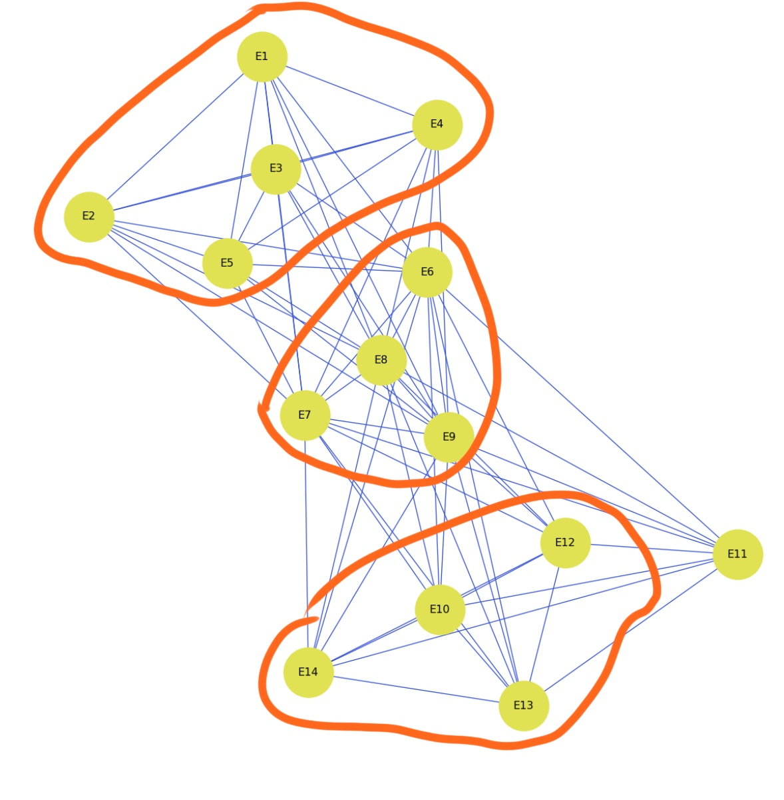

::: {.callout-note appearance="minimal" icon="false"}
[Here is a
dataset](http://vlado.fmf.uni-lj.si/pub/networks/data/ucinet/ucidata.htm#davis)
that shows a simple 2-node network: the attendance of 18 Southern Women at 14
social events.

Small “musty” datasets like that from this 1941 study have proven very valuable
in testing and comparing new network algorithms.

[Click here for Python code to create
dataset](https://networkx.github.io/documentation/stable/auto_examples/algorithms/plot_davis_club.html)

**What can you infer about the relationships between (1) the women, and (2) the
social events?**
:::

# Two Mode Networks- Davis Social Southern Club Women

```{python}
#| echo: true
#| warning: false
#| error: false

import networkx as nx
from networkx.algorithms import bipartite
import matplotlib.pyplot as plt
import pandas as pd
import numpy as np
```

## Data Load

The data can be imported through NetworkX.

```{python}
graph1= nx.davis_southern_women_graph()
```

I'll add some color to the nodes to differentiate between event and person.

```{python}
#--adding some distinction--
nodecolor=["#E0E446" if graph1.nodes[n]["bipartite"]== 0 else "#F5722B" for n in graph1.nodes()]

#-- visualizing the graph--
pos= nx.spring_layout(graph1, seed=212)
plt.figure(figsize= (12,12))
nx.draw(graph1, with_labels=True, node_color= nodecolor, node_size=3000, edge_color= "#334ED8", font_size=12, pos=pos)
plt.show()
```

While it may be tempting to assume relationships (because of clusters of women
in the graph), the the raw graph is really only depicting each woman's
relationship to an event, not relationships between the women. To infer about
relationships, the graph must be changed into a one-mode network.

First I'll create a matrix. The events should be the columns and the rows will
be the women. Attendance will appear as a 1 or a 0. I'll create the data frame
from the graph created and and go from there.

```{python}
#-- changing graph edges to df--
edges1= nx.to_pandas_edgelist(graph1)
```

```{python}

#-- changing to df and checking whats what--
nodes1= pd.DataFrame.from_dict(dict(graph1.nodes(data=True)), orient= "index")
nodes1= nodes1.reset_index()
nodes1.columns= ["Node", "Bipartite"]
nodes1
```

```{python}
#-- separateing the nodes--
people= nodes1[nodes1["Bipartite"]== 0]["Node"].tolist()
events= nodes1[nodes1["Bipartite"]== 1]["Node"].tolist()

#--creating the matrix--
matrix_a= edges1.pivot_table(index="source", columns="target", aggfunc=len, fill_value=0)
matrix_a
```

`matrix_a` shows what each woman's attendance is in relation to the events; who
attended what.

$$woman \ \times \ event  $$\
\
From here we'll multiply the matrix by its transpose. The matrix's transpose
would each event in relation to who attended.

$$
event\ \times \ woman
$$

So in multiplying matirx_a by its transpose, we get what overlaps, or the
women's shared connections. Each value is how many events a pair attended
together.

$$
woman \ \times \ woman
$$

```{python}
relationships= matrix_a @ matrix_a.T
relationships
```

Now we have the foundation for making assumptions about the social network of
the women. I'll remove the women's relationship with themselves (diagonal
values) because it'll overpower my visualizations.

I'll visualize the graph:

```{python}
#-- filling the diagonal of matrix--
np.fill_diagonal(relationships.values, 0)
social_club= nx.from_pandas_adjacency(relationships)

#--visualizing--
plt.figure(figsize= (12,12))
nx.draw(social_club, with_labels=True, node_color= "#E0E446", node_size=3000, edge_color= "#334ED8", font_size=12)
plt.title("Social Network of Davis Club Women")
plt.show()
```

Chapter 5 of Social Network Analysis for Startups (pg 104) defines a function
for whats called the **Island Method**. This method basically isolates the
connections by weight, creating "islands" of strongly connected networks.

```{python}
#-- chapter 5 function--
def trim_edges(G, weight=1):
    G2= nx.Graph()
    for u, v, d in G.edges(data=True):
        if d["weight"] > weight:
            G2.add_edge(u, v, **d)
    return G2
```

The distribution of the treshold/weights will help determining what number to
select for the trimming function.

```{python}
#--determining threshold to use in func--
weights= list(nx.get_edge_attributes(social_club, "weight").values())
pd.Series(weights).value_counts().sort_index()

#-- running the function--
trimmed= trim_edges(social_club, weight= 4)

#--visualizing--
plt.figure(figsize= (10,10))
nx.draw(trimmed, with_labels=True, node_size=3000, node_color= "#E0E446", edge_color= "#334ED8", font_size=12)
plt.title("Social Network of Davis Club Women")
plt.show()
```

Most edges are gathered at threshold 1 and 2, selecting 3 or 4 as the threshold
would be best.

The new graph shows the most central social circles within the Davis club.

```{python}
social_edges= nx.to_pandas_edgelist(social_club).sort_values("weight", ascending=False)
print(social_edges.head(5))
```

Evelyn and Brenda appear twice as sources. We can infer Evelyn, Brenda, and
Katherina are central and important in this social club. The islands depicted
Evelyn and Brenda are in one social circle, and Katerina is central to another
island that includes Sylvia and Nora.

### Event Networks

To make inferences about the events, we'll flip the matrix \* matrix transpose
and quickly redo the same analysis.

```{python}
#-- overlap matrix--
event_rel= matrix_a.T @ matrix_a

#--removing the diag values--
np.fill_diagonal(event_rel.values, 0)
event_g= nx.from_pandas_adjacency(event_rel)

#--visualizing--
plt.figure(figsize= (12,12))
nx.draw(event_g, with_labels=True, node_color= "#E0E446", node_size=3000, edge_color= "#334ED8", font_size=12)
plt.title("Events Network of Davis Club Women")
plt.show()
```

The network has some slight clustering:

{fig-align="center" width="307"}

We'll continue by trimming and using the output to infer:

```{python}

#--picking a threshold--
weights2= list(nx.get_edge_attributes(event_g, "weight").values())
pd.Series(weights2).value_counts().sort_index()

#-- trim function--
trimmed2= trim_edges(event_g, weight= 4)

#--visualizing--
plt.figure(figsize= (12,12))
nx.draw(trimmed2, with_labels=True, node_color= "#E0E446", node_size=3000, edge_color= "#334ED8", font_size=12)
plt.title("Event x Event Network of Davis Club Women")
plt.show()

#--List
event_edges= nx.to_pandas_edgelist(event_g).sort_values("weight", ascending=False)
print(event_edges.head(5))
```

E8 appears 4 times and is identified as central, connecting directly to E5, E6,
E7, and E9.

## Conclusion

In modifying a two mode network, into a one mode network, one can gain accurate
insights into social networks' relationship structure. The island method helps
identify relationships that are most central by implementing a threshold. Within
the Davis Club member relationship structure, we can infer that some of the
women have these *island* connections. I think Brenda, Evelyn, and Katherina are
central to inner social circles within the club. We can also infer that Event 8
was a hub within the events network, many of of the same members attended along
with the events E8 was tied to (6,7,8 and 9).

--------------------------------------------------------------------------------

## Bibliography:

Tsvetovat, M., & Kouznetsov, A. (2011). Social Network Analysis for Startups:
Finding connections on the social web (1st ed.). O'Reilly Media.

Social Network Analysis: Analyzing Two-Mode Networks:

<https://www.youtube.com/watch?v=o0Mxjll7-6o>
